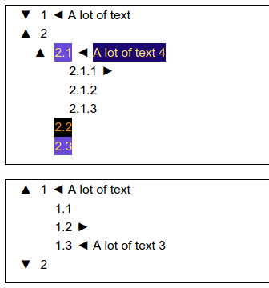

# IPyTreeWidget
A tree-view widget for Jupyter notebook.

Source codes only (currently). Uses HTML widget from ipywidgets. All nodes and hints are collapsable.

A tree is a node or list of nodes.

A node is a dictionary containing string keys associated with proper values: 
*text* - text label for a node. 
*hint* - extra information connected to a node. 
*childs* - list of nodes. 
*text-color*, *text-bkcolor* - color of the text and background of a node. Use HTML colors here. 
*hint-color*, *hint-bkcolor* - color of the hint's text and background of a node. Use HTML colors here. 

<<<<<<< HEAD

=======

>>>>>>> 631a4f5f7dfc415025c10ceed559522c25084020
